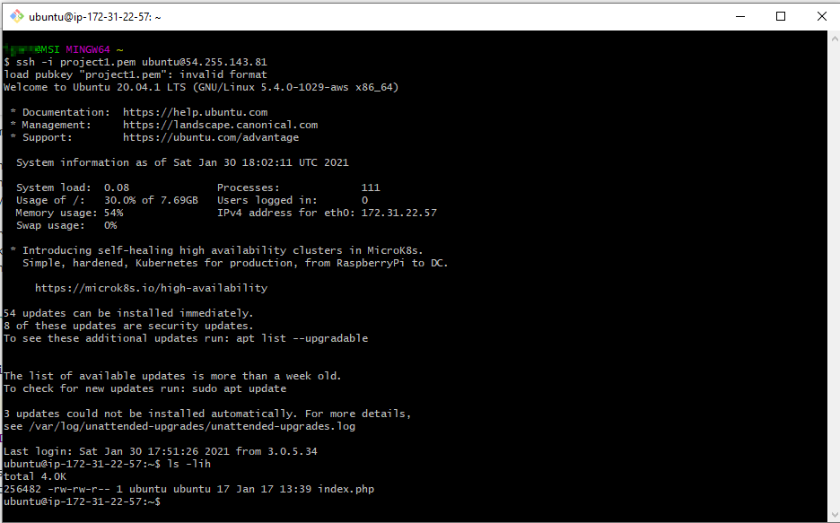
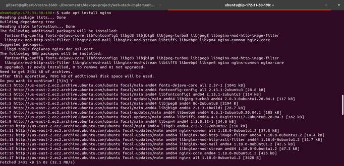

# web-stack-implementation-lemp-stack-
You have done a great job with successful completion of Project 1.

In this project you will implement a similar stack, but with an alternative Web Server - [NGINX](https://nginx.org/en/), which is also very popular and widely used by many websites in the Internet.

**Side Self Study**
- Make yourself familiar with basic [SQL syntax and most commonly used commands](https://www.w3schools.com/sql/sql_syntax.asp)
-  Be comfortable using not only VIM, but also [Nano editor](https://www.nano-editor.org/) as well, get to know [basic Nano commands](http://www.linuxandubuntu.com/home/nano-cli-text-editor-for-everyone-basic-tutorials)

In order to complete this project you will need an AWS account and a virtual server with Ubuntu Server OS.

If you do not have an AWS account - go back to [Project 1 Step 0](https://starter-pbl.darey.io/en/latest/project1.html) to sign in to AWS free tier account and create a new EC2 Instance of t2.nano family with Ubuntu Server 20.04 LTS (HVM) image. Remember, you can have multiple EC2 instances, but make sure you STOP the ones you are not working with at the moment to save available free hours.

**Hint:** In previous project we used Putty on Windows to connect to our EC2 Instance, but there is a simpler way that do not require conversion of **.pem** key to **.ppk** - using [Git Bash](https://git-scm.com/downloads).

Download and install Git Bash like it is shown in [this video](https://youtu.be/qdwWe9COT9k).

Launch Git Bash and run following command:

ssh -i <Your-private-key.pem> ubuntu@<EC2-Public-IP-address>

It will look like this:

## installing the nginx web server
In order to display web pages to our site visitors, we are going to employ Nginx, a high-performance web server. We’ll use the **apt** package manager to install this package.

Since this is our first time using **apt** for this session, start off by updating your server’s package index. Following that, you can use **apt install** to get Nginx installed:

- sudo apt update
- sudo apt install nginx
